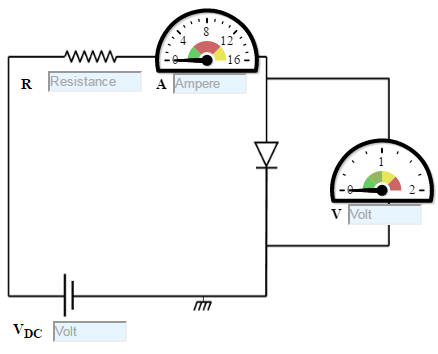
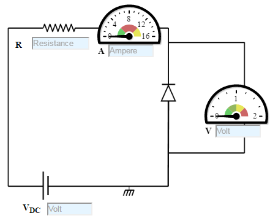

### Procedure

### Forward Bias-Si Diode
1. Set DC voltage to 0.2 V .
2. Select the diode.
3. Set the resistor.
4. Voltmeter is placed parallel to Silicon diode and ammeter series with resistor.
5. The positive side of battery to the P side(anode) and the negative of battery to the N side(cathode) of the diode.
6. Now vary the voltage upto 5V and note the Voltmeter and Ammeter reading for particular DC voltage .
7. Take the readings and note Voltmeter reading across Silicon diode and Ammeter reading.
8. Plot the V-I graph and observe the change.
9. Calculate the dynamic resistance of the diode. rd=ΔV/ΔI
10. Therefore from the graph we see that the diode starts conducting when the forward bias voltage exceeds around 0.6 volts (for Si diode). This voltage is called cut-in voltage.

Figure:1

### Reverse Bias-Si Diode
1. Set DC voltage to 0.2 V .
2. Select the diode.
3. Set the resistor.
4. Voltmeter is placed parallel to Silicon diode and ammeter series with resistor.
5. The positive terminal of battery is connected to the N side(cathode) and the negative terminal of battery is connected to the P side(anode) of a diode.
6. Now vary the voltage upto 30V and note the Voltmeter and Ammeter reading for DC voltage .
7. Take the readings and note Voltmeter reading across Silicon diode and Ammeter reading.
8. Plot the V-I graph and observe the change.

Figure: 2

### Forward Bias-Ge Diode
1. Set DC voltage to 0.2 V .
2. Use the resistor of 1K ohms and a Germanium diode.
3. Voltmeter is placed parallel to Germanium diode and ammeter series with resistor.
4. The positive terminal of battery is connected to the P side(anode) and the negative terminal of battery is connected to the N side(cathode) of the diode.
5. Now vary the voltage upto 30V and note the Voltmeter and Ammeter reading for particular DC voltage .
6. Take the readings and note Voltmeter reading across Germanium diode and Ammeter reading.
7. Plot the V-I graph and observe the change.
8. Therefore from the graph we see that the diode starts conducting when the forward bias voltage exceeds around 0.3 volts (for Ge diode). This voltage is called cut-in voltage.

Figure: 3

### Reverse Bias-Ge Diode
1. Set DC voltage to 0.2 V .
2. Use the resistor of 1K ohms and a Germanium diode.
3. Voltmeter is placed parallel to Germanium diode and ammeter series with resistor.
4. The positive terminal of battery is connected to the N side(cathode) and the negative terminal of battery is connected to the P side(anode) of a diode.
5. Now vary the voltage upto 30V and note the Voltmeter and Ammeter reading for DC voltage .
6. Take the readings and note Voltmeter reading across Silicon diode and Ammeter reading.
7. Plot the V-I graph and observe the change.

Figure: 4

