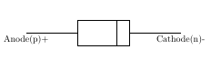
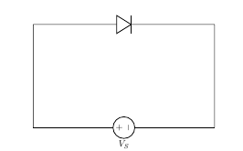
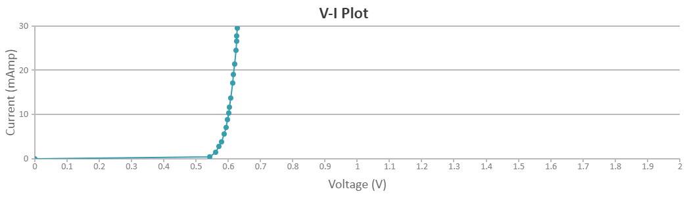
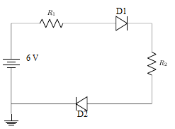
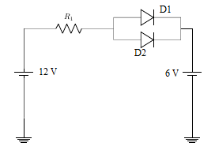

# Theory

### Structure of P-N junction diode

The diode is a device formed from a junction of n-type and p-type semiconductor material. The lead connected to the p-type material is called the anode and the lead connected to the n-type material is the cathode. In general, the cathode of a diode is marked by a solid line on the diode.

Figure 1  

Figure 2  

### Function of a P-N junction diode in Forward Bias

The positive terminal of battery is connected to the P side(anode) and the negative terminal of battery is connected to the N side(cathode) of a diode, the holes in the p-type region and the electrons in the n-type region are pushed toward the junction and start to neutralize the depletion zone, reducing its width. The positive potential applied to the p-type material repels the holes, while the negative potential applied to the n-type material repels the electrons. The change in potential between the p side and the n side decreases or switches sign. With increasing forward-bias voltage, the depletion zone eventually becomes thin enough that the zone's electric field cannot counteract charge carrier motion across the p–n junction, which as a consequence reduces electrical resistance. The electrons that cross the p–n junction into the p-type material (or holes that cross into the n-type material) will diffuse into the nearby neutral region. The amount of minority diffusion in the near-neutral zones determines the amount of current that may flow through the diode.

Figure 3  

### Function of a P-N junction diode in Reverse Bias

The positive terminal of battery is connected to the N side(cathode) and the negative terminal of battery is connected to the P side(anode) of a diode. Therefore, very little current will flow until the diode breaks down.

Figure 4  

The positive terminal of battery is connected to the N side(cathode) and the negative terminal of battery is connected to the P side(anode) of a diode, the 'holes' in the p-type material are pulled away from the junction, leaving behind charged ions and causing the width of the depletion region to increase. Likewise, because the n-type region is connected to the positive terminal, the electrons will also be pulled away from the junction, with similar effect. This increases the voltage barrier causing a high resistance to the flow of charge carriers, thus allowing minimal electric current to cross the p–n junction. The increase in resistance of the p–n junction results in the junction behaving as an insulator.
The strength of the depletion zone electric field increases as the reverse-bias voltage increases. Once the electric field intensity increases beyond a critical level, the p–n junction depletion zone breaks down and current begins to flow, usually by either the Zener or the avalanche breakdown processes. Both of these breakdown processes are non-destructive and are reversible, as long as the amount of current flowing does not reach levels that cause the semiconductor material to overheat and cause thermal damage.

### Forward and reverse biased characteristics of a Silicon diode

**In forward biasing**, the positive terminal of battery is connected to the P side and the negative terminal of battery is connected to the N side of the diode. Diode will conduct in forward biasing because the forward biasing will decrease the depletion region width and overcome the barrier potential. In order to conduct, the forward biasing voltage should be greater than the barrier potential. During forward biasing the diode acts like a closed switch with a potential drop of nearly 0.6 V across it for a silicon diode. The forward and reverse bias characteristics of a silicon diode. From the graph, you may notice that the diode starts conducting when the forward bias voltage exceeds around 0.6 volts (for Si diode). This voltage is called cut-in voltage.

Figure 5  

**In reverse biasing**, the positive terminal of battery is connected to the N side and the negative terminal of battery is connected to the P side of a diode. In reverse biasing, the diode does not conduct electricity, since reverse biasing leads to an increase in the depletion region width; hence current carrier charges find it more difficult to overcome the barrier potential. The diode will act like an open switch and there is no current flow.

### Forward and reverse biased characteristics of a Germanium diode

**In forward biasing**, the positive terminal of battery is connected to the P side and the negative terminal of battery is connected to the N side of the diode. Diode will conduct in forward biasing because the forward biasing will decrease the depletion region width and overcome the barrier potential. In order to conduct, the forward biasing voltage should be greater than the barrier potential. During forward biasing the diode acts like a closed switch with a potential drop of nearly 0.3 V across it for a germanium diode. The forward and reverse bias characteristics of a germanium diode. From the graph, you may notice that the diode starts conducting when the forward bias voltage exceeds around 0.3 volts (for Ge diode). This voltage is called cut-in voltage.

Figure 6  

**In reverse biasing**, the positive terminal of battery is connected to the N side and the negative terminal of battery is connected to the P side of a diode. In reverse biasing, the diode does not conduct electricity, since reverse biasing leads to an increase in the depletion region width; hence current carrier charges find it more difficult to overcome the barrier potential. The diode will act like an open switch and there is no current flow.

### Diode Equation

In the forward-biased and reversed-biased regions, the current If, and the voltage Vf, of a semiconductor diode are related by the diode equation:

$$I_f=I_s(exp^{\frac{V_f}{nV_T}}−1)$$

where, 
Is is reverse saturation current or leakage current, 
If is current through the diode(forward current), 
Vf is potential difference across the diode terminals(forward voltage) 
VT is thermal voltage, given by 

$$V_T=\frac{kT}{q}$$

and
k is Boltzmann’s constant = 1.38x10−23 J /°Kelvin,
q is the electronic charge = 1.6x10−19 joules/volt(Coulombs),
T is the absolute temperature in °Kelvin(°K = 273 + temperature in °C),
At room temperature (25 °C), the thermal voltage is about 25.7 mV,
n is an empirical constant between 0.5 and 2

The empirical constant, n, is a number that can vary according to the voltage and current levels. It depends on electron drift, diffusion, and carrier recombination in the depletion region. Among the quantities affecting the value of n are the diode manufacture, levels of doping and purity of materials.

If n=1, the value of $$\frac{kT}{q}$$ is 26 mV at 25°C.
When n=2, the value of $$\frac{kT}{q}$$ becomes 52 mV. For germanium diodes, n is usually considered to be close to 1. For silicon diodes, n is in the range of 1.3 to 1.6.

### Note

1. Ideal Diode Model:Diode is a simple switch that is either closed (conducting) or open (non conducting). Specifically, the diode is a short circuit, like a closed switch, when voltage is applied in the forward direction, and an open circuit, like an open switch, when the voltage is applied in the reverse direction.
2. Offset Voltage Model:The offset voltage model adds the barrier potential to the ideal switch model. When the diode is forward biased it is equivalent to a closed switch in series with a small equivalent voltage source equal to the barrier potential (0.6 V for Silicon, 0.2 for germanium) with the positive side towards the anode. When the diode is reverse biased, it is equivalent to an open switch just as in the ideal model.
3. Complete diode Model:It is the most accurate of the diode models. The Complete diode model of a diode consists of the barrier potential, the small forward dynamic resistance and the ideal diode. The resistor approximates the semiconductor resistance under forward bias. This diode model most accurately represents the true operating characteristics of the real diode.
4. When a diode is reverse biased a leakage current flows through the device. This current can be effectively ignored as long as the reverse breakdown voltage of the diode is not exceeded. At potentials greater than the reverse breakdown voltage, charge is pulled through the p-n junction by the strong electric fields in the device and large reverse current flows. This usually destroys the device. There are special diodes that are designed to operate in breakdown. Such diodes are called zener diodes and used as voltage regulators.

### When is each Model used ?
**Ideal Diode Model:** This is primarily used in troubleshooting. Is the diode working or not. The greatest utility of the ideal diode model is in determining which diodes are on and which are off in a multi-diode circuit.

**Offset Voltage Model:** This is used when a more accurate determination of load current or voltage is required.

**Complete Diode Model:** This is use during the actual design of circuits using diodes.

<!--## Assignment

1. Derive the ideal current-voltage relationship for a pn junction diode.Explain the procedure that is used in deriving the ideal current-voltage relationship in a pn junction diode.

2. A forward potential of 10V is applied to a Si diode. A resistance of 1 KΩ is also in series with the diode. Find the current.
[Ans:9.3 mA ]

3. The current flowing in a certain PN junction at room temperature is 2×10−7 A, when a large reverse bias voltage is applied. Calculate the current when a forward voltage of 0.1 V is applied across the junction.
[Ans:29.38 μ A]

4. Calculate the total current I through the following circuit.The Diodes D1 and D2 are silicon diodes, R1=1.1 KΩ , R2=1.2 KΩ .
[Ans:2 mA ]

Figure 7  

5. Find the current I in the following circuit.The Diodes D1 and D2 are made of silicon diodes and the forward resistance of both the diodes is zero, R1=3 KΩ.
[Ans:3.1 mA ]

Figure 8  

6. Calculate built in potential of a germanium PN junction at 300K, if P-side is doped with 5×1016 acceptors/cm3 and N-side with 5×1014 donors/cm3, intrinsic carrier density ni=2.5×1013 /cm3.
[Hint: Vbi=VT×lnNA×NDn2i]
[Ans:0.275 Volt]

7. A germanium p-n step junction has donor density ND=1015/ cm3 on n-side and acceptor density NA=1017/cm3 on p-side. Calculate the potential barrier at the junction if intrinsic carrier density ni = 2.5×1013 /cm3. Assume k×Tq = 0.026V.
[Ans:0.311 volt]

8. Calculate the built-in potential barrier, Vbi for Si, Ge and GaAs pn junctions if they each have the following dopant concentrations at T = 300 K:
ND=1014, NA=1017
ND=5×1016, NA=5×1016
where intrinsic carrier density of Si ni = 1.5×1010 /cm3, intrinsic carrier density of Ge ni = 2.4×1013 /cm3, intrinsic carrier density of GaAs ni = 1.8×106 /cm3
[Ans:1.Vbi for Si=0.63 Volt, Vbi for Ge=0.25 Volt, Vbi for GaAs=1.10 Volt
2. Vbi for Si=0.78 Volt, Vbi for Ge=0.39 Volt, Vbi for GaAs=1.25 Volt]

9. Consider an ideal pn junction diode at T = 300 K operating in the forward-bias region. Calculate the change in diode voltage that will cause a
factor of 10 increase in current
factor of 100 increase in current.
[Ans:60mVolt, 120mVolt]

10. The Schottky barrier height()of Tungsten - ntype silicon Schottky junction is 0.54V. The effective Richardson constant is A∗=100A/k2−cm2.Calculate
the ideal reverse saturation current and[Hint: Is=A×A∗×T2×exp(−e×ΦBnkB×T)]
the diode current for applied voltage of 0.04V at T300K[Hint: I=Is×[exp(e×VakB×T)−1]]
Given that the cross sectional area of the device is A=5×10−4cm2
[Ans:1. Is=4.3×10−4A, 2. I=20.64A] -->